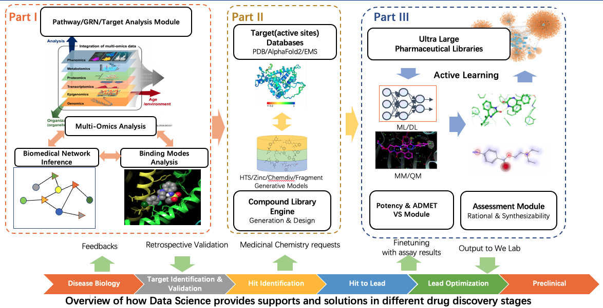

# Targeting COVID-19: GHDDI Info Sharing Portal
This is a public repo for information sharing portal about nCov/SARS/MERS for drug discovery community, initiated by [GHDDI](http://www.ghddi.org)

We're continuously releasing scientific materials to help the scientific community fight this COVID-19 pandemic, including curated data, updated research reports, discussions etc. You can find these materials at   

**Portal URL: https://ghddi-ailab.github.io/Targeting2019-nCoV/**

## Guide for Discussion
For any discussion please post them at the `issue` section of this repo. You're welcome to join our discussion for any scientific subject, feature request and bug report.

## A Short Tutorial for Content Contributor
You're also welcome to contribute content for this community info sharing portal. To minimize the cost for layout formatting from our contributors, we use the Markdown format to publish our content.

### Contribute Content
Write your contents in markdown format and save them in `/docs` folder, with file extention **.md**

### Organize Pages
Specify your content in `mkdocs.yml`, section `nav` as follows:
```
    - COVID:
      - todo I: todo_I.md
      - todo II: todo_II.md
```
in which `COVID` will be top level folder, and `todo I` and `todo II` will be the second level pages

### Raise Pull Request
After the content editting is finished, remember to raise pull request for content merging.

### Markdown Format Specification
https://guides.github.com/features/mastering-markdown/

----
### Who We Are
We're from GHDDI (The Global Health Drug Discovery Institute). GHDDI was jointly founded by Tsinghua University, the Bill & Melinda Gates Foundation, and the Beijing Municipal Government. The Institute is a transformative drug discovery and translational platform with advanced biomedical research and development capabilities. It is an independent, not-for-profit institute with a broad interest in addressing global health concerns, regardless of financial incentives, and intends to focus its efforts on tackling the world’s most pressing disease challenges faced by many developing countries.



GHDDI Data Science group consists of 10 scientists and engineers, who are Dr. Jinjiang Guo, Dr. Xiaoying Lv, Dr. Han Guo, Dr. Jie Li, Yuan Zhang, Dr. Song Hu, Xi Lu, Chen Liang, Qi Liu and Zhuo Tang. We are from cross-disciplines: computational chemistry, bioinformatics, computer science and software engineering. We manage 57 GHDDI local High-Performance Computing (HPC) clusters, over 1 billion chemical, biological and pharmaceutical data. With our self-developed AI systems, tools and commercial software, we provide various services for solving real-world problems in drug discovery pipelines, meanwhile we also devote to exploit technological innovations in applications to boosting drug discovery process. We are building fundamental technologies to aid our scientists to get smart starts and make better decisions. 
