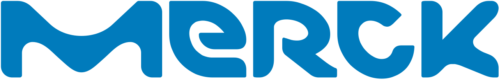

# 目标COVID-19：GHDDI信息共享门户

{[English](https://ghddi-ailab.github.io/Targeting2019-nCoV/), [中文](https://ghddi-ailab.github.io/Targeting2019-nCoV/CN_index/)}

这是[GHDDI]发起的药物发现社区的公共信息共享门户和数据存储库(http://www.ghddi.org)。我们正在使我们的药物发现能力和资源免费提供给所有正在开发COVID-19新治疗方法的研究人员。我们希望这一举措将加速这种致命的病毒性疾病的药物发现过程。初步工作包括以下内容：

1)GHDDI将使其高通量筛选平台和多个化合物库可供所有研究人员进行基于靶标或表型的筛选。这些化合物库包括[ReFRAME](https://reframedb.org/)化合物库(全球同类最大的集合，包含超过12000种已知药物，其中大部分已通过I期临床研究)、基于多样性的合成化合物库、天然产物库、中药提取物库等。我们欢迎具有高质量COVID-19相关酶试验或表型试验的研究小组讨论ReFrame文库筛选的长期合作计划。

2)GHDDI将免费为全球研究人员提供其COVID-19资源，包括：

 * GHDDI COVID-19数据存储库：抗病毒药理学数据库、SARS-CoV-2靶标和相关宿主靶标的3D结构数据和覆盖数百万市售化合物的虚拟化合物库；

 * GHDDI COVID-19计算系统：训练有素的AI药物筛选模型和完全配置的基于Pytorch的深度学习环境，使用GOLD等工具的常规虚拟筛选系统，具有并行处理能力的AutoDock和Amber、NAMD等生物物理学计算工具进行目标机制研究和对接细化的自由能计算。

3)GHDDI将与CRO合作(衷心感谢BioDuro所做的承诺和贡献)提供的服务包括  小分子化学合成、药物设计、药物化学、DMPK、靶蛋白生成/生物物理学/结构生物学等

4)GHDDI将提供疾病生物学、药学科学和药物发现方面的咨询。

我们有信心，在世界范围内研究界的共同努力下，我们将攻克这种新型冠状病毒！

### 与GHDDI连接

为了协调和最大限度地利用我们的资源，如果您希望与我们合作或获得我们的技术支持，请联系我们，并填写[**在线申请表**](http://ghddionlineform.mikecrm.com/KRLHRTl)。一旦您的申请获得批准，我们将尽快联系您。谢谢！

### 我们是谁

我们来自GHDDI(全球健康药物研发中心)。GHDDI由清华大学、比尔及梅琳达盖茨基金会、北京市政府联合创办。该研究所是一个变革性的药物发现和转化平台，具有先进的生物医学研发能力。它是一个独立的非营利性机构，对解决全球健康问题有广泛的兴趣，无论财政激励措施如何，并打算将努力重点放在应对许多发展中国家面临的世界最紧迫的疾病挑战上。GHDDI在药物化学、先导生成/高通量筛选、CADD和基于AI的药物发现、结构生物学、DMPK和动物设施等领域建立了几个一流的研究平台。我们希望分享我们的专业知识和资源，并与具有相关疾病生物学或互补药物发现和开发专业知识的合作伙伴合作，有兴趣寻找新型冠状病毒的新治疗方法。此外，GHDDI与中国和全球超过20家研究机构、制药公司和疾病联盟建立了广泛的伙伴关系。

### 免责声明

该网站的数据仅用于研究目的，不得用于临床建议。GHDDI不对任何错误或遗漏或使用该信息获得的结果负责。本研究中心的所有信息均以“原样”提供，不保证完整性、准确性、及时性或使用该信息获得的结果。

由 [默克集团](https://www.merckgroup.com/en) 提供赞助.
 

[Atman](https://atman360.com/) 提供的翻译服务

{[English](https://ghddi-ailab.github.io/Targeting2019-nCoV/), [中文](https://ghddi-ailab.github.io/Targeting2019-nCoV/CN_index/)}

上次更新：{{git_revision_date_localized}}
